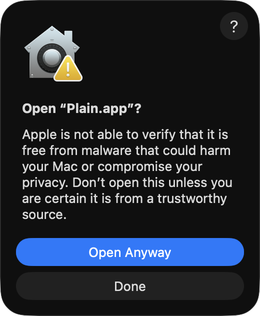

<p align="center">
  <a href="https://browseplain.com/">
    
  </a>
</p>

<h1 align="center">Plain</h1>

<p align="center">
  <strong>When you want the readable web, browse Plain.</strong>
</p>

<p align="center">
  <a href="https://browseplain.com/">Website</a>
  ·
  <a href="https://docs.browseplain.com/">Docs</a>
  ·
  <a href="https://github.com/mikaelvesavuori/plain-browser/releases/latest">Download Plain</a>
</p>

Plain is a native macOS, document-first browser for the readable web. The current release is **Plain 1.1.1**.

It opens web pages, follows links, searches the web, keeps history, and supports back/forward navigation. The difference is what happens after a page is fetched: Plain removes the active web runtime, extracts the useful text and images, and renders the result as a calm SwiftUI document.

The spirit is simpler internet: reading and navigating without the usual pile-on of tracking, privacy-invasive tactics, ads, popups, autoplaying embeds, and scripts running around the page. Plain is still a browser in the practical sense, but it is intentionally narrow. When a page needs a full web-app runtime, Plain can hand it to the default browser.

Search is intentionally narrow too: address-bar text that is not a URL goes to Mojeek instead of Google or another big-tech default.

Plain is small by design. The Apple silicon package is a 3.1 MB DMG, a 2.7 MB zip, and an 8.8 MB `.app` bundle.

## At A Glance

- Plain is a small native macOS browser for reading and moving through the web with less page machinery.
- It is best for articles, blogs, docs, reference pages, simple websites, and search-driven browsing.
- Plain News adds a calm source-based digest with RSS/web sources, rolling or calendar windows, local article selection, and save-to-Later support.
- It is intentionally not a full web-app browser for banking, shopping carts, rich editors, dashboards, video apps, or complex login flows.
- Address-bar searches use Mojeek instead of Google or another big-tech default.
- Plain has no telemetry, no account, no sync, no remote AI calls for page reading or Plain News, no automatic crash reporting, and no page JavaScript execution.
- Plain 1.1.1 is ad-hoc signed and not notarized, so macOS may show a first-open warning on downloaded builds.

## Download Plain

Download the latest macOS build from [GitHub Releases](https://github.com/mikaelvesavuori/plain-browser/releases/latest). Use the `.dmg` for the easiest install, or the `.zip` if you prefer the raw `.app` bundle.

To install the `.dmg` build:

1. Open the downloaded `.dmg`.
2. Drag Plain into Applications.
3. If macOS warns on first launch, right-click Plain and choose Open.

If macOS blocks the app because it is not notarized, choose **Open Anyway** from the warning dialog. You can also open **System Settings > Privacy & Security**, find the Plain warning near the bottom, and allow it there.

<p>
  
</p>

Each release includes `SHA256SUMS.txt` so you can verify the downloaded `.dmg` or `.zip`:

```sh
shasum -a 256 -c SHA256SUMS.txt
```

Plain is ad-hoc signed and not notarized, so macOS may warn when opening a downloaded build. It does not require an Apple Developer Program membership to build locally or distribute unsigned builds.

## Product Docs

The full docs site lives under [docs/](docs/). The README stays focused on the end-user product story, while the docs cover installation, privacy, release packaging, and benchmark evidence in more detail.

Useful docs:

- [What is Plain?](docs/src/content/docs/getting-started/intro.mdx)
- [Installation](docs/src/content/docs/getting-started/installation.mdx)
- [Plain News](docs/src/content/docs/guides/plain-news.mdx)
- [Privacy and Security](docs/src/content/docs/reference/privacy-security.mdx)
- [Benchmarks and Claims](docs/src/content/docs/reference/benchmarks.mdx)
- [Release and Packaging](docs/src/content/docs/reference/release-packaging.mdx)

## Why Plain Exists

Modern browsers are built to run the whole web: apps, scripts, ads, dashboards, media, payments, extensions, trackers, feeds, accounts, and complex layouts. That power is useful, but it also made ordinary reading feel strangely heavy.

Plain is built for the quieter case: a page worth reading or following, without the machinery around it.

Plain treats HTML as source material, not as an application. It downloads the document, sanitizes it, builds a semantic model, fetches selected non-SVG document images when enabled, and presents the page with native typography instead of a WebView.

## How Plain Is Different

Most browsers compete on more capable browsing. Plain competes on calmer browsing and less runtime.

| Compared with                        | Plain's difference                                                                                                                                                                                |
|--------------------------------------|---------------------------------------------------------------------------------------------------------------------------------------------------------------------------------------------------|
| Chrome, Safari, Firefox, Edge, Brave | Those are general-purpose browsers for websites and web apps. Plain is a simpler, document-first browser for readable pages. It does not execute page JavaScript or preserve full CSS layout. |
| Brave and privacy browsers           | Plain is not primarily an ad blocker inside a browser. It removes the browser runtime from the reading surface and fetches only what its document pipeline needs.                             |
| Min and other minimal browsers       | Plain is not just a smaller browser UI. The page itself is transformed into a native document model.                                                                                          |
| Browser default search               | Plain uses Mojeek for address-bar searches, keeping search outside Google and other big-tech defaults. Mojeek result pages are cleaned into native Plain search results where possible.   |
| Bundled-engine apps                  | Plain does not ship a Chromium runtime. It is a small native Swift app that leans on macOS system frameworks and its own document pipeline.                                                   |
| Arc, Dia, Zen, Orion                 | Those rethink browser chrome, workspaces, engines, AI, privacy, or productivity. Plain rethinks the page boundary: readable content in, active runtime out.                                   |
| NanoBrowser and agentic browsers     | Those automate or augment browsing. Plain keeps readable pages inert, quiet, and local-first by design.                                                                                   |

Plain is best when browsing means reading, researching, following links, and moving through mostly textual pages. It is the wrong tool for banking, shopping carts, rich editors, SaaS dashboards, social feeds, complex login flows, video apps, and anything that only exists after JavaScript runs.

## What It Does Today

- Opens URLs and non-URL address-bar searches in a native macOS window.
- Uses Mojeek as the default search engine instead of Google or another big-tech search default.
- Renders Mojeek search result pages as clean native search results when possible.
- Follows redirects, strips common tracking parameters, and fetches HTML with a conservative request policy.
- Removes scripts, styles, forms, iframes, canvas, media embeds, hidden elements, unsafe URL attributes, and obvious tracking pixels.
- Extracts titles, metadata, headings, paragraphs, links, lists, quotes, code blocks, simple tables, figures, captions, and images.
- Renders the result with native SwiftUI views rather than `WKWebView`.
- Ships as a small native macOS app; the current Apple silicon DMG is 3.1 MB.
- Fetches selected non-SVG document images through Plain's own image pipeline and a bounded local cache.
- Keeps a local Later list for pages you want to return to, available from the toolbar with Markdown export.
- Includes Plain News for source-based reading digests from RSS and web sources, with rolling `1-30` day, This Week, and Yesterday windows.
- Uses Apple Foundation Models locally for Plain News article selection and summaries when available, with a local heuristic fallback.
- Supports true text-only loading when images are turned off before fetching a page.
- Includes back/forward navigation, recent pages, light/dark/system appearance, fullscreen, copy clean text, copy Markdown, clear history, clear image cache, and Open in Default Browser.
- Registers `plain://open?url=<encoded-url>` in packaged builds for future local handoff integrations and shortcuts.

## Privacy Model

Plain is private by default:

- No telemetry.
- No analytics.
- No account.
- No sync.
- No remote AI calls for page reading or Plain News.
- No automatic crash reporting.
- No page JavaScript execution.
- No persistent cookies for page or image fetches.
- No direct subresource loading from arbitrary page HTML.
- Non-URL address-bar searches are sent to Mojeek, not Google or another big-tech default.

Plain checks GitHub Releases on startup for update metadata. That request contains no page URLs, searches, Later items, or browsing history.

Page and image requests use ephemeral, cookie-free `URLSession` configurations. Plain clears `Cookie`, `Referer`, and `Origin` headers, applies a 15-second timeout, limits HTML responses to 2 MB, blocks credential-bearing URLs, and blocks localhost, private-network, reserved-network, and local-domain targets by default. Before fetching, Plain resolves hostnames and rejects targets that resolve to local or private IP addresses. Remote SVG images are skipped. When images are enabled, image hosts can still see an image request from your network.

Plain News fetches RSS feeds, source pages, article pages, and selected images directly from your Mac. It does not send articles, interests, sources, or summaries to a remote AI service. Source publishers, CDNs, DNS resolvers, and your network provider can still observe normal feed and article fetches.

Recent pages, Later items, Plain News sources, interests, and the selected news window are stored locally in macOS user defaults. Fetched images are cached locally in Application Support, capped at 50 MB, and pruned when files are older than 30 days. Release builds use App Sandbox with network-client entitlements.

See [Privacy and Security](docs/src/content/docs/reference/privacy-security.mdx) for the full privacy and security boundary.

## Security Posture

Plain is more secure than a normal browser for passive reading in one specific way: it does not run the page as an app. There is no `WKWebView`, no page JavaScript execution, no browser extensions, no form runtime, no iframes, no media embeds, no third-party script tree, and no persistent cookie jar attached to the reading surface.

Instead, Plain fetches HTML into an ephemeral, cookie-free session, sanitizes the markup, extracts a semantic document model, and renders that model with native SwiftUI/AppKit views. That removes many common browser attack surfaces from readable pages, especially script execution, extension interaction, active embeds, cross-site subresources, and tracking-heavy page machinery.

This is not the same as being a hardened replacement for Safari, Chrome, or Firefox. Plain still parses untrusted HTML, downloads selected images when enabled, resolves links, stores local history/cache data, and depends on the macOS networking, image, text, and filesystem stacks. Treat it as a safer document reader for articles and reference pages, not as a secure environment for banking, authenticated web apps, file downloads, payments, or hostile-site investigation.

## One-Off Reading

If you want a quick, web-based version of the same idea without installing the macOS app, try [Reader](https://reader.mikaelvesavuori.workers.dev). It is a separate Cloudflare Worker project hosted by the author, not Plain, but it offers similar one-off page cleanup in a regular browser.

The Reader source is available at [github.com/mikaelvesavuori/reader](https://github.com/mikaelvesavuori/reader) for people who want similar functionality on a more ad hoc or self-hosted basis.

## Reporting Page Issues

Some pages will always need extractor work because the readable web is built from inconsistent HTML. If a readable page looks wrong in Plain, use `More > Report Page Issue` in the app, email [hello@browseplain.com](mailto:hello@browseplain.com), or open a [GitHub issue](https://github.com/mikaelvesavuori/plain-browser/issues/new).

Useful reports include the page URL, what looked wrong, what you expected, whether images were enabled, and a screenshot if possible.

## Project Status

Plain is currently **Plain 1.1.1**. It is useful for readable pages today, with one deliberate boundary: pages that require a full web-app browser should open in the default browser.

The current release includes the native app, semantic extraction, local non-SVG document image fetching and cache, recent pages, Later list with Markdown export and adjacent-item navigation, Plain News, text/Markdown export, clear-history/cache controls, URL handoff, sandboxed packaging, privacy-oriented fetch policy, and benchmark claim tooling.

Known limitations:

- JavaScript-heavy pages can fail or appear incomplete.
- Readable pages can extract poorly when the source HTML is unusual or misleading; please report those pages so the extractor can improve.
- Full CSS layout is not preserved.
- There are no tabs, browser extensions, accounts, sync, password manager, autofill, payment flows, or full web-app compatibility.
- Release builds are ad-hoc signed, not Developer ID signed or notarized, so Plain remains unsigned in the practical macOS distribution sense.

For release details, see [Release and Packaging](docs/src/content/docs/reference/release-packaging.mdx).

## Keyboard Shortcuts

| Action                       | Shortcut                |
|------------------------------|-------------------------|
| Open location / search       | `Cmd-L`                 |
| Show/open Plain window       | `Cmd-N`                 |
| Reload current page          | `Cmd-R`                 |
| Back / forward               | `Cmd-[` / `Cmd-]`       |
| Show history                 | `Cmd-Y`                 |
| Find in page                 | `Cmd-F`                 |
| Find next / previous         | `Cmd-G` / `Shift-Cmd-G` |
| Smaller / larger reader text | `Cmd--` / `Cmd-+`       |
| Toggle serif/sans font       | `Cmd-Option-T`          |
| Toggle images                | `Shift-Cmd-I`           |
| Toggle appearance            | `Shift-Cmd-L`           |
| Toggle full screen           | `Ctrl-Cmd-F`            |
| Open in default browser      | `Cmd-Option-O`          |
| Save/remove page from Later  | `Cmd-D`                 |
| Show Later list              | `Shift-Cmd-D`           |
| Copy clean text              | `Shift-Cmd-C`           |
| Copy Markdown                | `Shift-Cmd-M`           |

`Esc` dismisses the address bar or find panel when focused.

## Evidence-Backed Claims

Plain keeps public performance claims tied to benchmark evidence. The numbers below come from the latest benchmark run.

<!-- plain-claims:start -->
Plain's latest benchmark comparison was captured against Chromium on a 20-URL corpus with 3 iterations per URL, using 60/60 paired successful URL/iteration comparisons for each mode.

Benchmark-backed claims from the latest run:

- Plain text-only downloaded 78% fewer bytes than Chromium: 104.1 KB vs 477.9 KB median transfer.
- Plain text-only made 95% fewer network requests than Chromium: 1 vs 19 median requests.
- Plain text-only reached a rendered native document 60% sooner than Chromium full page load: 512ms vs 1.29s median.
- Plain with images enabled downloaded 76% fewer bytes than Chromium: 115.6 KB vs 477.9 KB median transfer.
- Plain with images enabled reached a rendered native document 61% sooner than Chromium full page load: 504ms vs 1.29s median.
- Plain executed 0 page JavaScript by design.

Evidence captured 2026-05-22T13:10:24.038Z on macOS 26.3, arm64, Mac14,2, Chromium 148.0.7778.96.
<!-- plain-claims:end -->

Plain's strongest durable claim is architectural: it executes 0 page JavaScript by design.

## Developer Notes

### Run Locally

```sh
swift run Plain
```

This opens a native macOS window. The terminal stays occupied while Plain is running; quit the app with `Cmd-Q` to return to the shell prompt.

You can also use the project command helper:

```sh
make run
```

If an old invisible debug instance is still running:

```sh
pkill Plain
```

### Docs Site

```sh
make docs-deps
make docs-dev
```

### Test

```sh
make test
```

This runs the Swift unit tests.

For the Swift tests plus benchmark claim-policy tests:

```sh
make test-all
```

The claim tests guard benchmark math and the architecture test protects the "0 page JavaScript by design" claim by blocking accidental WebKit, `WKWebView`, or JavaScriptCore usage.

GitHub push/PR CI runs deterministic checks only: Swift tests, claim-policy unit tests, and the docs build. It does not run measured browser or power benchmarks.

### Build Release

```sh
make package
```

This creates:

- `dist/Plain.app`
- `dist/Plain-<version>-macos-<arch>.zip`
- `dist/Plain-<version>-macos-<arch>.dmg`
- `dist/SHA256SUMS.txt`

Refresh the published size note with:

```sh
du -sh dist/Plain.app dist/Plain-*.zip dist/Plain-*.dmg
```

The app is ad-hoc signed and does not require an Apple Developer Program membership. It is not Developer ID signed or notarized, so macOS may warn users when they open downloaded builds on other machines.

For benchmark or marketing-claim code changes:

```sh
make package-claims
```

On GitHub, pushing a version tag builds and publishes the downloadable release assets:

```sh
git tag v1.1.1
git push origin v1.1.1
```

The release workflow derives the app version from the tag, builds the docs, runs the claim-aware package build, and attaches the `.dmg`, `.zip`, and checksum file to a GitHub Release.

### URL Handoff

Packaged builds register the `plain://` URL scheme:

```text
plain://open?url=https%3A%2F%2Fexample.com%2Farticle
```

Plain also accepts a direct startup URL:

```sh
open dist/Plain.app --args https://example.com/article
```

### Benchmarks

Plain includes repeatable benchmark tooling for performance, memory use, resource use, power, and public-claim support.

Run a local smoke comparison:

```sh
make bench-smoke
```

Run the full marketing gate for benchmark-backed release copy:

```sh
make bench-marketing
```

Measure the qualified local power claim:

```sh
sudo make bench-power-measure
make bench-power-postprocess
```

See [Benchmarks and Claims](docs/src/content/docs/reference/benchmarks.mdx) for the browser baseline, claim policy, and comparison workflow.
